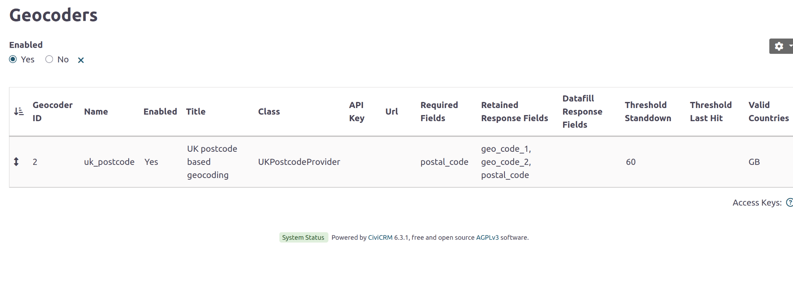
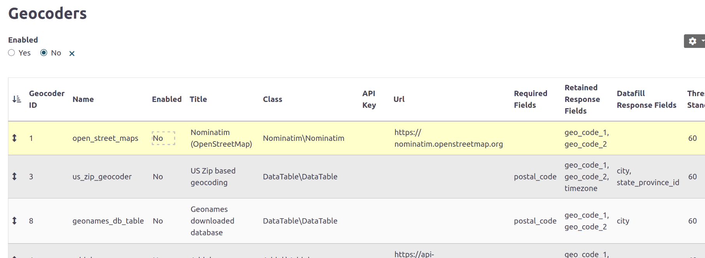

**Set up**

Under Administer->Localization->Geocoders you will find the configuration table.

By default it shows enabled Geocoders

If you toggle it you can show disabled Geocoders - use edit-in-place to enable them.

